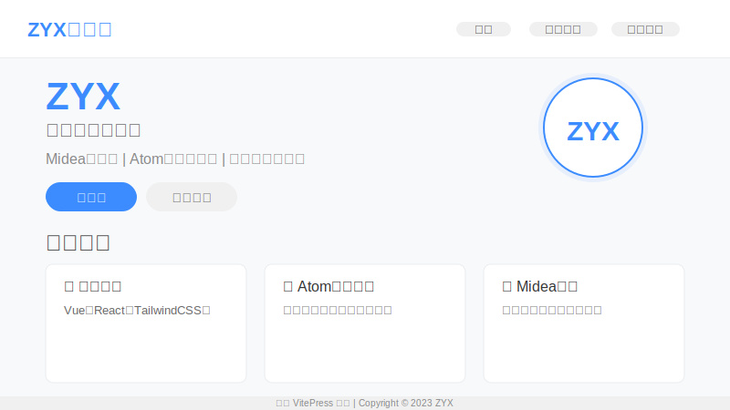

# ZYX的博客

一个基于VitePress构建的现代化个人博客，专注于技术分享和项目展示。



## 🚀 特点

* **现代化设计** - 简洁美观的UI设计，响应式布局支持各种设备
* **高性能** - 基于VitePress构建，页面加载速度快
* **丰富功能** - 博客分类、项目展示、个人简介和搜索功能
* **完善的SEO** - 针对搜索引擎优化的元标签和结构
* **暗黑模式** - 支持亮色/暗色主题切换
* **内容丰富** - 技术博客、开源项目、个人经历分享

## 📋 博客内容

* **技术博客** - JavaScript、TypeScript、Vue、React等前端技术文章
* **开源项目** - 展示个人开发的项目和贡献的开源作品
* **Midea实习** - 分享在美的集团的实习经历和技术成长
* **个人介绍** - 关于我的个人资料和联系方式

## 🔧 技术栈

* **VitePress** - 基于Vite的静态站点生成器
* **Vue 3** - 渐进式JavaScript框架
* **Element Plus** - Vue 3的组件库
* **SCSS/CSS** - 样式和动画
* **Markdown** - 内容编写

## 📁 项目结构

```
项目根目录
├── docs/                  # 文档和内容
│   ├── .vitepress/        # VitePress配置
│   │   ├── config.js      # 网站配置文件
│   │   └── theme/         # 自定义主题
│   ├── public/            # 静态资源
│   │   ├── screenshots/   # 截图图片
│   │   ├── projects/      # 项目相关图片
│   │   └── icons/         # 图标资源
│   ├── posts/             # 博客文章
│   │   ├── javascript/    # JavaScript文章
│   │   ├── typescript/    # TypeScript文章
│   │   ├── vue/           # Vue相关文章
│   │   └── ...            # 其他分类
│   ├── projects/          # 项目展示页面
│   ├── about/             # 关于我页面
│   └── index.md           # 网站首页
├── scripts/               # 工具脚本
│   └── create-screenshot.js # 生成网站截图
├── .github/workflows/     # GitHub Actions工作流
│   └── deploy.yml         # 自动部署配置
└── package.json           # 项目依赖
```

## 💻 本地开发

### 环境要求

* Node.js 16+
* Bun (推荐) 或 npm

### 安装步骤

1. 克隆仓库

```bash
git clone https://github.com/zjtdzyx/my-blog.git
cd my-blog
```

2. 安装依赖

```bash
# 使用Bun（推荐）
bun install

# 或使用npm
npm install
```

3. 启动开发服务器

```bash
# 使用Bun
bun run docs:dev

# 或使用npm
npm run docs:dev
```

4. 构建生产版本

```bash
# 使用Bun
bun run docs:build

# 或使用npm
npm run docs:build
```

## 📱 响应式设计

博客采用响应式设计，适配以下设备屏幕：

* 手机(<768px)：单列布局
* 平板(768px-1200px)：双列布局
* 桌面(>1200px)：三列布局

## 🎨 主题定制

项目使用了VitePress的主题自定义功能，增加了：

* 自定义首页布局
* 博客文章目录组件
* 项目卡片展示组件
* 个人资料卡片
* 定制的导航和页脚

## 🚀 部署

此博客可以部署在：

* GitHub Pages（已配置自动部署）
* Vercel
* Netlify
* 任何支持静态网站的托管服务

### GitHub Pages自动部署

本项目已配置GitHub Actions工作流，当代码推送到`main`分支时，将自动构建并部署到GitHub Pages。

1. 确保已在仓库设置中启用GitHub Pages
2. 选择"GitHub Actions"作为Pages的构建和部署源
3. 推送代码到`main`分支即可触发自动部署

也可以在Actions选项卡中手动触发部署工作流。

### 自定义域名配置

项目已配置自定义域名`zjtxzyx.xyz`：

1. 在域名提供商处添加以下DNS记录：
   - A记录：`@` -> `185.199.108.153`
   - A记录：`@` -> `185.199.109.153`  
   - A记录：`@` -> `185.199.110.153`
   - A记录：`@` -> `185.199.111.153`
   - CNAME记录：`www` -> `zjtdzyx.github.io`

2. CNAME文件已配置在`docs/public/CNAME`中
3. GitHub Actions工作流会自动生成CNAME文件

## 📜 许可证

MIT

## 👤 作者

* ZYX
* GitHub: [@zjtdzyx](https://github.com/zjtdzyx) 