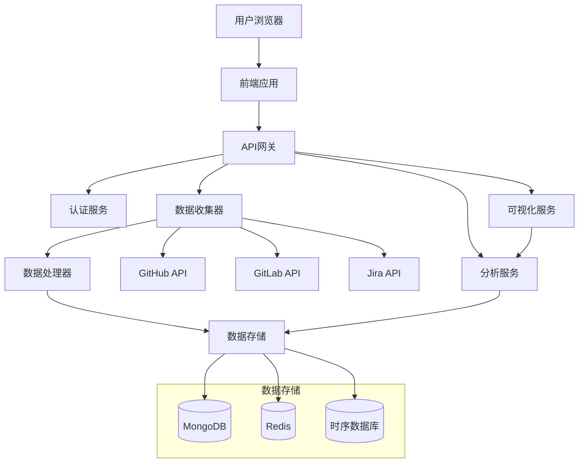

# Atom-Stats

::: info
Atom-Stats是一个项目数据可视化分析平台，帮助开发团队深入了解项目健康度、协作效率和开发趋势。
:::

## 项目概述

**GitHub仓库**: [https://github.com/FightingTrip/atom-stats](https://github.com/FightingTrip/atom-stats)

**在线预览**: [https://atom-stats.vercel.app](https://atom-stats.vercel.app)

Atom-Stats通过收集、分析和可视化GitHub项目数据，为开发团队提供全面的项目健康度评估和数据洞察。无论是个人开发者想要了解自己的项目状况，还是团队负责人需要评估团队协作效率，Atom-Stats都能提供直观、有价值的数据分析。

## 核心功能

### 仪表盘与概览

- **项目健康度评分**: 基于活跃度、代码质量、响应时间等指标的综合评分
- **核心指标卡片**: 直观展示PR合并率、问题解决率、代码提交频率等关键指标
- **趋势分析**: 项目活跃度、贡献者数量、代码量等关键指标的历史趋势
- **团队概览**: 团队组成、核心贡献者和贡献分布分析

### 代码贡献分析

- **提交热力图**: 直观展示代码提交时间分布
- **代码变更统计**: 按文件类型、目录结构分析代码增减情况
- **贡献者排行**: 基于提交次数、代码行数等维度的贡献者排名
- **代码审查效率**: PR审查时长、评论数量、修改频率等指标分析

### 问题与PR分析

- **问题生命周期**: 跟踪问题从创建到关闭的完整流程
- **解决效率**: 平均解决时间、首次响应时间等效率指标
- **分类统计**: 按标签、优先级、模块等维度统计问题分布
- **PR合并趋势**: PR数量、合并率、反馈速度等指标的历史变化

### 团队协作分析

- **协作网络图**: 可视化团队成员间的协作关系
- **代码评审矩阵**: 展示团队成员间的代码评审频率和质量
- **知识分布**: 分析团队在不同模块和文件上的专业知识分布
- **工作负载**: 评估团队成员的工作负载平衡情况

## 技术架构

### 前端技术栈

- **框架**: Vue.js 3 + TypeScript
- **状态管理**: Pinia
- **UI框架**: Naive UI
- **数据可视化**: ECharts + D3.js
- **HTTP客户端**: Axios + VueQuery
- **路由管理**: Vue Router

### 后端技术栈

- **服务框架**: Node.js + Fastify
- **数据库**: MongoDB + Redis
- **认证**: Auth0 + JWT
- **API集成**: GitHub API + GitLab API
- **数据处理**: Apache Spark (大数据分析)
- **缓存**: Redis + Node-Cache

### 部署与DevOps

- **服务托管**: Vercel (前端) + Heroku (后端)
- **CI/CD**: GitHub Actions
- **监控**: Sentry + New Relic
- **数据备份**: MongoDB Atlas
- **安全扫描**: SonarQube + Snyk

## 系统架构图



## 项目进展

### 已完成功能

- [x] GitHub项目数据集成
- [x] 基础仪表盘与数据可视化
- [x] 代码提交分析
- [x] 问题跟踪分析
- [x] 团队贡献统计
- [x] 多项目对比

### 正在开发

- [ ] GitLab项目支持
- [ ] 高级团队协作网络分析
- [ ] 预测分析与趋势预测
- [ ] 自定义报表生成
- [ ] API集成与webhook支持

### 未来规划

- 集成更多代码托管平台 (Bitbucket, Gitee等)
- 添加智能推荐系统，提供改进建议
- 开发项目健康度预警系统
- 支持更复杂的多维数据分析
- 提供可嵌入的数据组件，用于团队站点

## 技术亮点

### 高性能数据处理管道

我们设计了高性能的数据处理管道，能够处理大量的Git提交和项目数据：

```typescript
// dataProcessor.ts
export class GitDataProcessor {
  private readonly batchSize = 100;
  
  constructor(
    private readonly dataSource: DataSource,
    private readonly storage: DataStorage,
    private readonly logger: Logger
  ) {}
  
  async processRepository(repoUrl: string): Promise<ProcessResult> {
    this.logger.info(`开始处理仓库数据: ${repoUrl}`);
    
    // 1. 获取基本仓库信息
    const repoInfo = await this.dataSource.getRepositoryInfo(repoUrl);
    
    // 2. 并行获取并处理不同类型的数据
    const [commits, issues, pullRequests] = await Promise.all([
      this.processCommits(repoUrl),
      this.processIssues(repoUrl),
      this.processPullRequests(repoUrl)
    ]);
    
    // 3. 计算派生指标
    const metrics = this.calculateMetrics({
      commits,
      issues,
      pullRequests,
      repoInfo
    });
    
    // 4. 存储处理后的数据
    await this.storage.saveRepositoryData(repoUrl, {
      repoInfo,
      commits,
      issues,
      pullRequests,
      metrics,
      lastUpdated: new Date()
    });
    
    this.logger.info(`仓库数据处理完成: ${repoUrl}`);
    
    return {
      success: true,
      repoUrl,
      metrics,
      lastUpdated: new Date()
    };
  }
  
  private async processCommits(repoUrl: string): Promise<CommitData[]> {
    let page = 1;
    let allCommits: CommitData[] = [];
    let batch: CommitData[];
    
    // 分批获取提交数据，避免内存溢出
    do {
      batch = await this.dataSource.getCommits(repoUrl, {
        page,
        perPage: this.batchSize
      });
      
      // 并行处理每个提交的详细信息
      const processedBatch = await Promise.all(
        batch.map(commit => this.enrichCommitData(commit))
      );
      
      allCommits = [...allCommits, ...processedBatch];
      page++;
    } while (batch.length === this.batchSize);
    
    return allCommits;
  }
  
  private async enrichCommitData(commit: CommitData): Promise<CommitData> {
    // 获取提交的文件变更详情
    const changes = await this.dataSource.getCommitChanges(commit.id);
    
    // 分析代码变更
    const codeAnalysis = this.analyzeCodeChanges(changes);
    
    return {
      ...commit,
      changes,
      analysis: codeAnalysis
    };
  }
  
  // 其他数据处理方法...
}
```

### 高级可视化组件

我们开发了复杂的可视化组件，如这个团队协作网络图：

```typescript
// CollaborationNetwork.vue
<script setup lang="ts">
import { ref, onMounted, watch } from 'vue';
import * as d3 from 'd3';
import { useCollaborationData } from '@/composables/useCollaborationData';

const props = defineProps<{
  repositoryId: string;
  timeRange: [Date, Date];
}>();

const svgRef = ref<SVGElement | null>(null);
const { data, loading, error } = useCollaborationData(
  props.repositoryId, 
  props.timeRange
);

// 图表配置
const width = 800;
const height = 600;
const nodeRadius = 10;

// 创建力导向图
function createForceGraph() {
  if (!svgRef.value || !data.value) return;
  
  const svg = d3.select(svgRef.value);
  svg.selectAll("*").remove();
  
  const { nodes, links } = data.value;
  
  // 创建力导向模拟
  const simulation = d3.forceSimulation(nodes)
    .force("link", d3.forceLink(links).id(d => d.id).distance(100))
    .force("charge", d3.forceManyBody().strength(-300))
    .force("center", d3.forceCenter(width / 2, height / 2))
    .force("collide", d3.forceCollide().radius(nodeRadius * 2));
  
  // 绘制链接
  const link = svg.append("g")
    .selectAll("line")
    .data(links)
    .enter()
    .append("line")
    .attr("stroke-width", d => Math.sqrt(d.value))
    .attr("stroke", "#999")
    .attr("stroke-opacity", 0.6);
  
  // 创建节点容器
  const nodeGroup = svg.append("g")
    .selectAll("g")
    .data(nodes)
    .enter()
    .append("g")
    .call(d3.drag()
      .on("start", dragstarted)
      .on("drag", dragged)
      .on("end", dragended));
  
  // 绘制节点
  nodeGroup.append("circle")
    .attr("r", d => nodeRadius + d.contributions / 10)
    .attr("fill", d => d.type === 'contributor' ? '#36a2eb' : '#ff6384')
    .attr("stroke", "#fff")
    .attr("stroke-width", 1.5);
  
  // 添加节点标签
  nodeGroup.append("text")
    .attr("dx", 12)
    .attr("dy", ".35em")
    .text(d => d.name)
    .style("font-size", "12px");
  
  // 更新模拟
  simulation.on("tick", () => {
    link
      .attr("x1", d => d.source.x)
      .attr("y1", d => d.source.y)
      .attr("x2", d => d.target.x)
      .attr("y2", d => d.target.y);
    
    nodeGroup.attr("transform", d => `translate(${d.x}, ${d.y})`);
  });
  
  // 拖拽行为
  function dragstarted(event) {
    if (!event.active) simulation.alphaTarget(0.3).restart();
    event.subject.fx = event.subject.x;
    event.subject.fy = event.subject.y;
  }
  
  function dragged(event) {
    event.subject.fx = event.x;
    event.subject.fy = event.y;
  }
  
  function dragended(event) {
    if (!event.active) simulation.alphaTarget(0);
    event.subject.fx = null;
    event.subject.fy = null;
  }
}

onMounted(() => {
  if (data.value) {
    createForceGraph();
  }
});

watch(
  [() => data.value, () => props.timeRange],
  () => {
    if (data.value) {
      createForceGraph();
    }
  }
);
</script>

<template>
  <div class="collaboration-network">
    <div v-if="loading" class="loading">
      加载数据中...
    </div>
    <div v-else-if="error" class="error">
      {{ error.message }}
    </div>
    <svg ref="svgRef" :width="width" :height="height"></svg>
  </div>
</template>
```

## 参与贡献

Atom-Stats是一个开源项目，我们欢迎各种形式的贡献：

- **GitHub Issues**: [提交问题或建议](https://github.com/FightingTrip/atom-stats/issues)
- **Pull Requests**: [贡献代码](https://github.com/FightingTrip/atom-stats/pulls)
- **讨论**: [参与项目讨论](https://github.com/FightingTrip/atom-stats/discussions)

## 联系方式

如果您对项目有任何问题或建议，欢迎通过以下方式联系我们：

- Email: [yuxiangzhang040727@gmail.com](mailto:yuxiangzhang040727@gmail.com)
- GitHub: [@zjtdzyx](https://github.com/zjtdzyx)

---

::: tip 帮助我们改进
使用过程中有任何建议或遇到问题，都可以通过GitHub Issues反馈给我们。您的反馈是我们不断改进的动力！
::: 