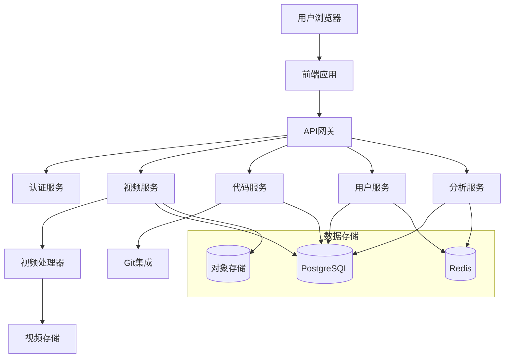

# Atom-Video

::: info
Atom-Video是一个面向开发者的视频分享CMS，专注于代码教程和技术分享内容的管理与展示。
:::

## 项目概述

**GitHub仓库**: [https://github.com/FightingTrip/atom-video](https://github.com/FightingTrip/atom-video)

**在线预览**: [https://atom-video.vercel.app](https://atom-video.vercel.app)

Atom-Video致力于为开发者提供一个专业的视频教程分享平台，解决传统视频平台对开发者内容支持不足的问题。通过集成代码展示、交互式时间轴和智能章节标记等功能，大幅提升了技术视频的学习体验。

## 核心功能

### 视频内容管理

- **多格式视频支持**: 支持MP4、WebM、AV1等多种视频格式
- **自动转码处理**: 使用FFmpeg自动转码为适合Web播放的格式
- **云存储集成**: 支持AWS S3、七牛云、阿里云OSS等多种存储方案
- **批量管理**: 支持批量上传、标记和分类

### 代码与视频关联

- **代码片段嵌入**: 在视频播放的特定时间点展示相关代码片段
- **语法高亮**: 支持超过100种编程语言的语法高亮
- **代码变化追踪**: 展示在教程过程中代码的演变
- **一键复制**: 快速复制代码片段到剪贴板

### 交互式时间轴

- **章节标记**: 自动或手动为视频添加章节标记，便于导航
- **内容概要**: 每个章节提供内容概要，方便快速理解
- **智能跳转**: 基于内容相关性的智能跳转推荐
- **笔记与书签**: 用户可以在时间轴上添加个人笔记和书签

### 团队协作系统

- **基于角色的权限控制**: 管理员、编辑者、贡献者等不同角色
- **审核工作流**: 内容发布前的审核与反馈机制
- **协作评论**: 团队成员可以对视频内容进行内部评论和讨论
- **版本历史**: 追踪内容的修改历史和版本变更

## 技术架构

### 前端技术栈

- **框架**: React 18 + TypeScript
- **状态管理**: Redux Toolkit
- **样式解决方案**: TailwindCSS + Styled Components
- **UI组件**: 自研组件库 + HeadlessUI
- **视频播放**: Plyr + hls.js
- **代码展示**: CodeMirror 6 + Prism.js

### 后端技术栈

- **服务框架**: Node.js + Express
- **数据库**: PostgreSQL + Redis
- **认证**: JWT + OAuth2.0
- **文件处理**: Multer + Sharp
- **视频处理**: FFmpeg + WebRTC
- **API文档**: Swagger + OpenAPI 3.0

### 部署与DevOps

- **容器化**: Docker + Docker Compose
- **CI/CD**: GitHub Actions
- **监控**: Sentry + Prometheus
- **负载均衡**: Nginx + CloudFlare
- **CDN**: CloudFront / Cloudflare

## 系统架构图



## 项目进展

### 已完成功能

- [x] 基础视频上传与管理
- [x] 视频播放器与自定义控制
- [x] 代码片段关联系统
- [x] 用户认证与基本权限
- [x] 基础分析与统计
- [x] 响应式设计与移动端支持

### 正在开发

- [ ] 高级搜索与推荐系统
- [ ] AI自动章节划分
- [ ] 代码片段实时运行环境
- [ ] 互动式问答功能
- [ ] 完整的API文档

### 未来规划

- 支持更多的视频源集成
- 添加社区功能与用户互动
- 开发VS Code插件，直接从编辑器创建教程
- 支持多语言字幕与内容翻译

## 技术亮点

### 视频流优化

我们针对视频教程的特殊需求，开发了自适应比特率流媒体解决方案:

```javascript
// videoProcessor.js
class AdaptiveStreamProcessor {
  constructor(videoPath, outputDir) {
    this.videoPath = videoPath;
    this.outputDir = outputDir;
    this.ffmpeg = require('fluent-ffmpeg');
  }

  async generateHLS() {
    return new Promise((resolve, reject) => {
      this.ffmpeg(this.videoPath)
        .outputOptions([
          '-profile:v main',
          '-sc_threshold 0',
          '-g 48',
          '-keyint_min 48',
          // 生成多种分辨率的视频流
          '-map 0:v',
          '-map 0:v',
          '-map 0:v',
          '-map 0:a',
          // 240p
          '-s:v:0 426x240',
          '-c:v:0 libx264',
          '-b:v:0 400k',
          // 480p
          '-s:v:1 854x480',
          '-c:v:1 libx264',
          '-b:v:1 1400k',
          // 720p
          '-s:v:2 1280x720',
          '-c:v:2 libx264',
          '-b:v:2 2800k',
          // 音频设置
          '-c:a aac',
          '-b:a 128k',
          // HLS设置
          '-f hls',
          '-hls_time 4',
          '-hls_playlist_type vod',
          '-hls_segment_filename',
          `${this.outputDir}/segment_%v_%03d.ts`,
          '-master_pl_name master.m3u8',
          '-var_stream_map', 'v:0,a:0 v:1,a:0 v:2,a:0'
        ])
        .output(`${this.outputDir}/stream_%v.m3u8`)
        .on('end', resolve)
        .on('error', reject)
        .run();
    });
  }
}

module.exports = AdaptiveStreamProcessor;
```

### 代码同步系统

我们开发了时间轴与代码同步系统，实现了视频播放进度与代码展示的精确同步:

```typescript
// CodeSyncManager.tsx
interface CodeSegment {
  id: string;
  filename: string;
  language: string;
  code: string;
  startTime: number;
  endTime: number;
  description?: string;
}

const CodeSyncManager: React.FC<{
  videoTime: number;
  codeSegments: CodeSegment[];
}> = ({ videoTime, codeSegments }) => {
  const [activeSegment, setActiveSegment] = useState<CodeSegment | null>(null);
  
  useEffect(() => {
    // 根据当前视频时间找到对应的代码段
    const segment = codeSegments.find(
      seg => videoTime >= seg.startTime && videoTime <= seg.endTime
    ) || null;
    
    if (segment?.id !== activeSegment?.id) {
      setActiveSegment(segment);
    }
  }, [videoTime, codeSegments, activeSegment]);
  
  if (!activeSegment) {
    return <EmptyCodeView />;
  }
  
  return (
    <div className="code-sync-container">
      <div className="code-header">
        <span className="filename">{activeSegment.filename}</span>
        <span className="language">{activeSegment.language}</span>
      </div>
      <CodeEditor
        language={activeSegment.language}
        value={activeSegment.code}
        readOnly
        highlight
      />
      {activeSegment.description && (
        <div className="code-description">{activeSegment.description}</div>
      )}
    </div>
  );
};
```

## 参与贡献

我们欢迎开发者参与Atom-Video项目的贡献！无论是功能开发、Bug修复、文档完善还是创意建议，都非常欢迎。

- **GitHub Issues**: [提交问题或建议](https://github.com/FightingTrip/atom-video/issues)
- **Pull Requests**: [贡献代码](https://github.com/FightingTrip/atom-video/pulls)
- **开发文档**: [查看开发文档](https://github.com/FightingTrip/atom-video/wiki)

## 联系方式

如果您对项目有任何问题或建议，欢迎通过以下方式联系我们：

- Email: [yuxiangzhang040727@gmail.com](mailto:yuxiangzhang040727@gmail.com)
- GitHub: [@zjtdzyx](https://github.com/zjtdzyx)

---

::: tip 贡献指南
如果您想参与贡献，请先阅读我们的[贡献指南](https://github.com/FightingTrip/atom-video/blob/main/CONTRIBUTING.md)，了解代码规范和提交流程。
::: 